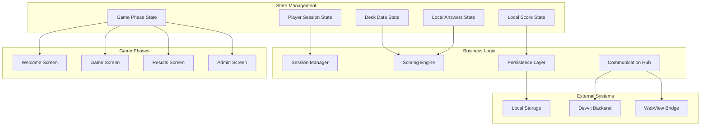

# Design Document

## Overview

The DebateDueler system is a comprehensive game orchestration component for a Reddit-based debate game application. This system serves as the central controller that manages the entire game lifecycle, coordinating between multiple UI screens, handling complex state management, implementing sophisticated scoring algorithms, and maintaining seamless communication with backend services. The implementation demonstrates advanced React patterns, real-time state synchronization, and robust error handling.

The system features multi-phase game management, persistent session recovery, real-time scoring calculations, and seamless integration with Devvit backend services, creating a cohesive gaming experience that handles edge cases and provides excellent user feedback.

## Architecture

### High-Level Architecture



### Component Architecture

The DebateDueler component implements a sophisticated state machine that orchestrates the entire game experience:

#### State Machine Design
- **Welcome Phase**: Initial state for game selection and mode configuration
- **Playing Phase**: Active gameplay with question progression and answer processing
- **Results Phase**: Game completion with final scores and statistics
- **Admin Phase**: Content management for authorized users

#### State Management Strategy
- **Centralized State**: Single source of truth for all game-related data
- **Local Caching**: Immediate UI responsiveness with localStorage persistence
- **Server Synchronization**: Periodic data validation and conflict resolution

## Component Interfaces

### DebateDueler Props Interface
The component is self-contained and requires no external props, managing all state internally.

### Key State Variables
```typescript
type GamePhase = 'welcome' | 'playing' | 'results' | 'admin';

interface ComponentState {
  gamePhase: GamePhase;
  deck: Deck | null;
  playerSession: PlayerSession | null;
  loading: boolean;
  error: string | null;
  isAdmin: boolean;
  localAnswers: PlayerAnswer[];
  localScore: number;
}
```

### Event Handlers and Callbacks
- **startGame**: Initializes new game session with scoring mode
- **submitAnswer**: Processes individual answers and updates progress
- **submitFinalResults**: Sends complete game data to backend
- **restartGame**: Resets all state for new game session
- **goToAdminScreen**: Transitions to administrative interface

## Data Flow and State Transitions

### Initialization Flow
1. Component mounts and sends INIT request to backend
2. Receives deck data, player session, and admin status
3. Checks localStorage for existing session data
4. Restores previous state or starts fresh
5. Transitions to appropriate initial phase

### Gameplay Flow
1. User selects scoring mode and starts game
2. System creates new session with initial state
3. For each question:
   - Displays question and starts timer
   - User submits answer
   - System calculates local score
   - Updates progress and advances to next question
4. When game completes, sends all data to backend
5. Transitions to results phase

### Session Recovery Flow
1. On application reload, check localStorage
2. Validate stored data against current deck
3. Restore session state and local answers
4. Resume at correct game phase
5. Handle data conflicts gracefully

## Scoring System Integration

### Local Scoring Engine
The component includes a sophisticated scoring algorithm that mirrors server-side logic:

#### Scoring Modes
- **Contrarian**: Score based on answer unpopularity
- **Conformist**: Score based on answer popularity
- **Trivia**: Score based on correctness

#### Question Types
- **Multiple Choice**: Binary correct/incorrect evaluation
- **Sequence**: Position-based accuracy with time bonuses

#### Time Bonus System
- Remaining time added directly to score
- Consistent across all scoring modes
- Encourages faster, more decisive answers

## Persistence and Recovery

### localStorage Strategy
- **Session Data**: Complete game state for recovery
- **Timer Data**: Question-specific timing information
- **Answer History**: Complete answer sequence for scoring

### Data Validation
- **Deck Consistency**: Verify stored deck matches current version
- **Session Integrity**: Ensure all required fields are present
- **Answer Validation**: Check answer format and question alignment

### Conflict Resolution
- **Server Priority**: Backend data takes precedence
- **User Progress Protection**: Preserve local answers when possible
- **Graceful Degradation**: Fall back to fresh start on conflicts

## Error Handling and Resilience

### Network Error Management
- **Connection Failures**: Retry logic with user feedback
- **Timeout Handling**: Appropriate error messages for slow responses
- **Data Corruption**: Validation and recovery mechanisms

### State Consistency
- **Atomic Updates**: Ensure state changes are complete or rolled back
- **Validation Guards**: Prevent invalid state transitions
- **Cleanup Procedures**: Proper resource disposal on errors

### User Experience
- **Loading States**: Visual feedback during async operations
- **Error Recovery**: Clear instructions for problem resolution
- **Graceful Degradation**: Continue operation when possible

## Performance Optimization

### Rendering Efficiency
- **Conditional Rendering**: Only render active phase components
- **Memoization**: Prevent unnecessary re-renders of complex calculations
- **Lazy Loading**: Defer non-critical component initialization

### Memory Management
- **State Cleanup**: Remove unused data structures
- **Event Listener Management**: Proper cleanup on unmount
- **Timer Management**: Cancel all active timers

### Computation Optimization
- **Local Calculations**: Avoid unnecessary backend calls during gameplay
- **Batch Updates**: Group related state changes
- **Efficient Algorithms**: Optimized scoring and validation logic

## Testing Strategy

### Unit Testing Approach
- **State Transitions**: Verify correct phase changes and data updates
- **Scoring Logic**: Comprehensive test cases for all algorithms
- **Persistence**: localStorage operations and data recovery
- **Error Handling**: Network failures and edge cases

### Integration Testing
- **Component Interactions**: Screen transitions and data flow
- **Backend Communication**: Message sending and response handling
- **Session Recovery**: State restoration across reloads

### End-to-End Testing
- **Complete Game Flows**: From start to finish scenarios
- **Error Recovery**: System behavior under adverse conditions
- **Performance Testing**: Load handling and responsiveness

## Security Considerations

### Data Validation
- **Input Sanitization**: Validate all user inputs before processing
- **Session Security**: Protect against session manipulation
- **Admin Authorization**: Verify permissions for sensitive operations

### Communication Security
- **Message Validation**: Ensure backend messages are properly formatted
- **Error Information**: Avoid exposing sensitive data in error messages
- **Rate Limiting**: Prevent abuse through excessive requests

This design represents a comprehensive game orchestration system that handles complex state management, real-time user interactions, and robust error recovery while maintaining excellent performance and user experience.