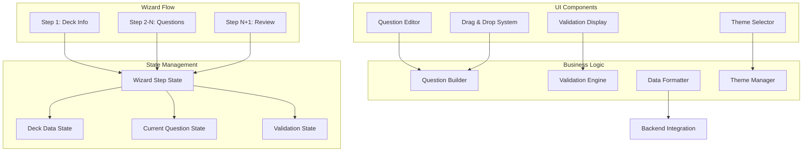

# Design Document

## Overview

The CreateDeckWizard system is a sophisticated multi-step form interface for a Reddit-based debate game application. This component implements a comprehensive deck creation workflow with support for multiple question types, drag-and-drop sequencing, real-time validation, and responsive design. The implementation demonstrates advanced React patterns, form state management, and user experience design principles.

The system features a step-by-step wizard pattern, dynamic question type switching, visual theme selection, and robust validation, creating an intuitive content creation experience that handles complex data structures and user interactions seamlessly.

## Architecture

### High-Level Architecture



### Component Architecture

The CreateDeckWizard implements a sophisticated wizard pattern with dynamic content:

#### Wizard State Machine
- **Step 1**: Deck metadata collection (title, description, theme)
- **Steps 2-N**: Individual question creation with type-specific interfaces
- **Step N+1**: Complete deck review and finalization

#### Dynamic Interface Adaptation
- **Question Type Switching**: Interface adapts based on multiple-choice vs sequence questions
- **Option Management**: Dynamic addition/removal of answer choices
- **Validation Feedback**: Real-time validation with contextual error messages

## Component Interfaces

### CreateDeckWizard Props Interface
```typescript
interface CreateDeckWizardProps {
  onClose: () => void;
  onSubmit: (deck: Deck) => void;
  username: string;
  userID: string;
}
```

### Key State Variables
```typescript
interface WizardState {
  step: number;
  deck: DeckData;
  currentQuestion: Question;
  errors: ValidationErrors;
  draggedIndex: number | null;
}
```

### Event Handlers
- **handleNext**: Validates current step and advances wizard
- **handleBack**: Returns to previous step with state preservation
- **updateCard**: Manages individual answer option updates
- **setCorrectCard**: Designates correct answers for multiple-choice
- **handleDragStart/End/Drop**: Manages drag-and-drop operations

## Wizard Flow Design

### Step Progression Logic
1. **Validation First**: Each step validates before allowing progression
2. **State Preservation**: All data maintained across step navigation
3. **Dynamic Step Count**: Number of steps based on question count
4. **Early Exit**: Users can cancel at any point with confirmation

### Data Accumulation Pattern
- **Incremental Building**: Questions added to deck as they're completed
- **State Consistency**: Current question state separate from accumulated data
- **Validation Scoping**: Errors scoped to current step or field

## Question Type System

### Multiple Choice Questions
- **Correct Answer Designation**: Single correct answer selection
- **Option Management**: 2-6 options with add/remove functionality
- **Validation Rules**: At least 2 options, one correct answer required

### Sequence Questions
- **Drag-and-Drop Ordering**: Visual reordering with sequence numbers
- **Position Tracking**: Automatic sequence number updates
- **Validation Rules**: All options must have valid sequence positions

### Type Switching
- **Data Preservation**: Valid data maintained when switching types
- **UI Adaptation**: Interface elements change based on question type
- **Validation Reset**: Type-specific validation rules applied

## Drag-and-Drop Implementation

### HTML5 Drag and Drop API
- **Event Handling**: Comprehensive drag event management
- **Visual Feedback**: CSS classes for drag states
- **Data Transfer**: Clean data passing between drag operations

### State Management
- **Dragged Index Tracking**: Current drag operation state
- **Array Manipulation**: Efficient reordering algorithms
- **Sequence Updates**: Automatic position number recalculation

### Error Handling
- **Invalid Drops**: Prevention of incorrect drop targets
- **State Recovery**: Rollback on failed operations
- **User Feedback**: Clear error messages for drag failures

## Validation System

### Real-Time Validation
- **Field-Level**: Immediate feedback on individual inputs
- **Step-Level**: Comprehensive validation before progression
- **Cross-Field**: Validation spanning multiple related fields

### Validation Rules
- **Required Fields**: Title, description, question prompts
- **Length Limits**: Character limits with user feedback
- **Logical Consistency**: Correct answer requirements, minimum options
- **Data Integrity**: Sequence order validation, option uniqueness

### Error Display
- **Inline Messages**: Contextual errors near problematic fields
- **Visual Indicators**: Color coding and icons for error states
- **Progressive Disclosure**: Errors revealed as user progresses

## Theme Integration

### Theme Data Structure
```typescript
interface ThemeFlair {
  id: string;
  label: string;
  icon: string;
  cssClass: string;
}
```

### Visual Selection Interface
- **Grid Layout**: Responsive theme selection grid
- **Visual Preview**: Icons and labels for each theme
- **State Management**: Selected theme applied to deck data

### Theme Application
- **CSS Class Assignment**: Theme-specific styling applied
- **Metadata Storage**: Theme information preserved in deck data
- **Fallback Handling**: Default themes for missing data

## Responsive Design

### Mobile Optimization
- **Touch-Friendly**: Large touch targets for mobile interaction
- **Layout Adaptation**: Single-column layouts on small screens
- **Font Scaling**: Readable text sizes across devices

### Keyboard Accessibility
- **Tab Navigation**: Full keyboard navigation support
- **Focus Management**: Clear focus indicators and logical tab order
- **Screen Reader Support**: ARIA labels and semantic markup

### Cross-Device Compatibility
- **Viewport Adaptation**: Responsive breakpoints and fluid layouts
- **Touch vs Mouse**: Appropriate interaction patterns for input methods
- **Performance**: Optimized rendering for various device capabilities

## Data Management

### State Persistence
- **Form State**: All user input preserved during wizard navigation
- **Validation State**: Error states maintained across interactions
- **Recovery**: Data preservation on unexpected interruptions

### Data Transformation
- **Question Building**: Individual questions assembled from form data
- **Deck Assembly**: Complete deck structure created from accumulated data
- **Backend Formatting**: Data formatted for API consumption

## Error Handling and Recovery

### Validation Failures
- **User-Friendly Messages**: Clear, actionable error descriptions
- **Field Highlighting**: Visual indicators for problematic inputs
- **Progressive Validation**: Errors revealed as user completes fields

### System Errors
- **Graceful Degradation**: Continued operation when possible
- **Recovery Options**: Clear paths to fix issues
- **Data Preservation**: User input maintained during error states

## Performance Optimization

### Rendering Efficiency
- **Conditional Rendering**: Only render active step content
- **Memoization**: Prevent unnecessary re-renders
- **Efficient Updates**: Targeted state updates for performance

### Memory Management
- **State Cleanup**: Remove unused data structures
- **Event Cleanup**: Proper event listener management
- **Resource Optimization**: Efficient DOM manipulation

This design represents a comprehensive wizard interface that handles complex form interactions, multiple data types, and sophisticated user interactions while maintaining excellent performance and accessibility.