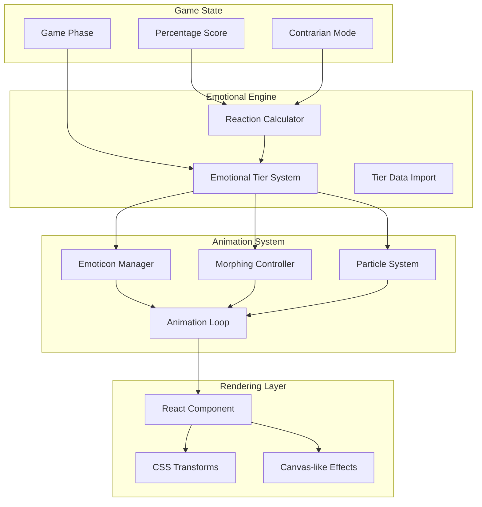

# Design Document

## Overview

The Live Background system is a dynamic visual enhancement for a Reddit-based debate game application. This system creates an immersive, animated background that responds to player choices and game state, providing real-time emotional feedback through particle effects, morphing animations, and atmospheric lighting. The implementation demonstrates advanced React animation techniques, performance optimization, and responsive design principles.

The system features sophisticated animation systems, emotional tier management, and seamless integration with game state, creating a compelling visual experience that enhances player engagement without compromising performance.

## Architecture

### High-Level Architecture



### Component Architecture

The LiveBackground component serves as the main orchestrator, managing multiple animation systems and state transitions.

#### LiveBackground Component
The core component that:
- Manages emotional tier determination based on game state
- Coordinates multiple animation systems (emoticons, morphing, bursts)
- Handles performance optimization and responsive design
- Provides clean prop interface for game integration

#### Animation Subsystems
- **Emoticon System**: Manages floating emoticon particles with physics
- **Morphing System**: Handles smooth transitions between emoticon states
- **Burst System**: Creates dramatic effects for strong reactions
- **Glow System**: Manages atmospheric lighting effects

## Data Models

### Core Data Structures

#### EmotionalTier Model
```typescript
type EmotionalTier = {
  name: TierName;
  color: string;
  emoticons: Array<{ text: string; weight?: number }>;
  chars: Array<{ text: string; weight?: number }>;
  range: [number, number];
}
```

#### EmoticonInstance Model
```typescript
type EmoticonInstance = {
  id: string;
  text: string;
  x: number;
  y: number;
  scale: number;
  opacity: number;
  rotation: number;
  velocity: { x: number; y: number };
  isChar: boolean;
  morphing: MorphingState | null;
}
```

#### MorphingState Model
```typescript
type MorphingState = {
  targetText: string;
  progress: number; // 0..1
  duration: number; // seconds
}
```

### Animation Patterns

#### Physics-Based Movement
- **Velocity Integration**: Position updates based on velocity and time delta
- **Boundary Handling**: Respawn logic when particles exit viewport
- **Randomization**: Varied initial properties for natural movement

#### Morphing Animation
- **Progress-Based Interpolation**: Smooth transitions using easing functions
- **Scale Effects**: Dynamic scaling during morph transitions
- **Duration Variation**: Randomized timing for organic feel

#### Burst Effects
- **Conditional Triggering**: Based on reaction intensity
- **Radial Distribution**: Centered positioning with varied angles
- **Fade Transitions**: Opacity animations for effect lifecycle

## Component Interfaces

### LiveBackground Props Interface
```typescript
interface LiveBackgroundProps {
  percentage?: number;
  isContrarian?: boolean;
  glowColor?: string;
  isActive?: boolean;
  tintStyle?: React.CSSProperties;
  showResults?: boolean;
}
```

### Key Methods and Hooks

#### useState Management
- `emoticons`: Array of active emoticon instances
- `currentTier`: Current emotional tier state
- `glowOpacity`: Atmospheric lighting intensity

#### useEffect Hooks
- **Tier Determination**: Updates emotional state based on game props
- **Initialization**: Creates initial emoticon set when tier activates
- **Animation Loop**: Manages 60fps update cycle
- **Morphing Triggers**: Handles state change reactions
- **Burst Effects**: Creates dramatic visual responses

## Animation System

### Core Animation Loop
The system uses `requestAnimationFrame` for smooth 60fps animations:
- Time-based updates with delta time calculation
- Position integration using velocity vectors
- Boundary checking and respawn logic
- Morphing progress advancement

### Performance Optimizations
- **Frame Rate Limiting**: Prevents excessive updates
- **Efficient Calculations**: Minimized mathematical operations
- **Hardware Acceleration**: CSS transforms for GPU rendering
- **Memory Management**: Proper cleanup on unmount

### Responsive Design
- **Dynamic Boundaries**: Adapts to container size changes
- **Proportional Scaling**: Maintains visual balance across screen sizes
- **Touch-Friendly**: Optimized for mobile performance

## Error Handling

### Data Validation
- **Tier Existence Checks**: Ensures valid emotional data
- **Prop Validation**: Handles undefined/null values gracefully
- **Boundary Constraints**: Prevents invalid animation states

### Performance Safeguards
- **Animation Cancellation**: Proper cleanup on component unmount
- **Memory Leak Prevention**: Reference clearing and event removal
- **Fallback Rendering**: Graceful degradation when animations fail

## Testing Strategy

### Unit Testing Approach
- **Animation Logic**: Test position calculations and physics
- **State Transitions**: Verify tier changes and morphing triggers
- **Prop Handling**: Validate input processing and defaults

### Integration Testing
- **Component Rendering**: Test visual output with different props
- **Animation Cycles**: Verify smooth transitions and performance
- **Responsive Behavior**: Test across different screen sizes

### Performance Testing
- **Frame Rate Monitoring**: Ensure consistent 60fps operation
- **Memory Usage**: Track emoticon instance management
- **Load Testing**: Performance under high emoticon counts

## Security Considerations

### Input Sanitization
- **Prop Validation**: Ensure numeric inputs are within bounds
- **String Sanitization**: Prevent XSS in emoticon text
- **Object Immutability**: Protect against state mutation

### Performance Protection
- **Resource Limiting**: Cap maximum emoticon instances
- **Animation Throttling**: Prevent excessive CPU usage
- **Memory Bounds**: Limit data structure sizes

This design represents a comprehensive animation system that enhances user experience through dynamic visual feedback while maintaining high performance and accessibility standards.