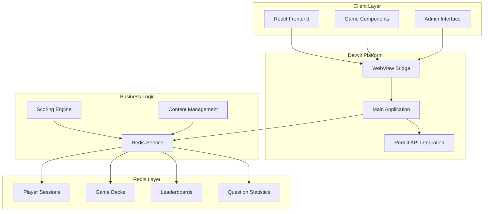

# Design Document

## Overview

The Redis Implementation system is a comprehensive data storage and management solution to be built for a Reddit-based debate game application. This system will demonstrate advanced Redis usage patterns and serve as a showcase project for the Kiro hackathon. The architecture will leverage Redis as the primary data store for game state, player sessions, leaderboards, and real-time statistics, providing a scalable foundation for multiplayer gaming experiences.

The system will feature sophisticated scoring algorithms, real-time data synchronization, and robust error handling. This design document outlines the architectural decisions and implementation patterns that will make this system a compelling example of modern Redis usage in web applications.

## Architecture

### High-Level Architecture



### Redis Data Architecture

The system employs a hierarchical key structure that enables efficient data organization and retrieval:

- **Player Sessions**: `game:{postId}:player:{userId}`
- **Question Statistics**: `stats:{postId}:{questionId}`
- **Leaderboards**: `leaderboard:{postId}`
- **Deck Storage**: `deck:{postId}`

This structure supports horizontal scaling and provides clear data boundaries for different game instances.

## Components and Interfaces

### RedisService Interface

The core `RedisService` interface provides a comprehensive API for all Redis operations:

```typescript
export type RedisService = {
    // Leaderboard Management
    getLeaderboard: (postId: string) => Promise<LeaderboardEntry[]>;
    updateLeaderboard: (postId: string, entry: LeaderboardEntry) => Promise<void>;

    // Player Data Management
    saveUserGameData: (postId: string, userId: string, answers: PlayerAnswer[], totalScore: number, sessionData: PlayerSession) => Promise<void>;
    getPlayerRank: (postId: string, userId: string) => Promise<number | null>;
    getPlayerSession: (postId: string, userId: string) => Promise<PlayerSession | null>;

    // Deck Management
    getDeck: (postId: string) => Promise<Deck | null>;
    saveDeck: (postId: string, deck: Deck) => Promise<void>;

    // Content Management
    addQuestionToDeck: (postId: string, question: Question) => Promise<void>;
    editQuestionInDeck: (postId: string, updatedQuestion: Question) => Promise<void>;
    deleteQuestionFromDeck: (postId: string, questionId: string) => Promise<void>;
}
```

### Client-Side Components

#### DebateDueler Component
The main game orchestrator that manages:
- Game state transitions (welcome → playing → results → admin)
- Local answer caching during gameplay
- Real-time score calculation
- Session persistence and recovery

#### DeckWizard Component
Advanced deck creation interface featuring:
- Multi-step wizard workflow
- Support for multiple question types (multiple-choice, sequence)
- Drag-and-drop sequence ordering
- Real-time validation and preview

#### AdminScreen Component
Content management interface providing:
- Question editing capabilities
- Permission-based access control
- Real-time content updates
- Bulk content operations

### Server-Side Architecture

#### Main Application Handler
The Devvit main application manages:
- WebView message routing
- Redis service instantiation
- User authentication and authorization
- Real-time data synchronization

#### Content Creation Pipeline
Automated post creation system that:
- Generates Reddit posts with custom previews
- Applies appropriate flair based on deck themes
- Initializes Redis data structures
- Handles post metadata management

## Data Models

### Core Data Structures

#### Deck Model
```typescript
type Deck = {
  id: string;
  title: string;
  description: string;
  theme: string;
  flairText?: string;
  flairCSS?: string;
  questions: Question[];
  questionStats?: QuestionStats[];
  createdBy: string;
  creatorID?: string;
  createdAt: number;
}
```

#### Player Session Model
```typescript
type PlayerSession = {
  userId: string;
  username: string;
  scoringMode: ScoringMode;
  answers: PlayerAnswer[];
  totalScore: number;
  currentQuestionIndex: number;
  gameState: GameState;
  startedAt: number;
  finishedAt?: number;
}
```

#### Question Statistics Model
```typescript
type QuestionStats = {
  questionId: string;
  cardStats: Record<string, number>;
  positionStats?: Record<string, Record<number, number>>;
  totalResponses: number;
}
```

### Redis Storage Patterns

#### Sorted Sets for Leaderboards
- **Key**: `leaderboard:{postId}`
- **Structure**: Sorted set with scores as values and userIds as members
- **Additional Data**: Detailed entries stored as JSON strings in `leaderboard:{postId}:{userId}`

#### JSON Serialization for Complex Objects
- **Player Sessions**: Stored as JSON strings with automatic serialization/deserialization
- **Deck Data**: Complete deck objects stored with nested question arrays and statistics
- **Statistics**: Real-time updates using atomic operations

#### Hierarchical Key Organization
- **Game Isolation**: Each Reddit post gets its own data namespace
- **User Isolation**: Player data is scoped to specific games and users
- **Content Versioning**: Questions maintain unique IDs across edits and deletions

## Error Handling

### Redis Connection Management
- **Connection Resilience**: Automatic retry logic with exponential backoff
- **Error Logging**: Comprehensive error tracking for debugging and monitoring
- **Graceful Degradation**: Fallback mechanisms when Redis is unavailable

### Data Validation
- **Input Sanitization**: All user inputs validated before Redis storage
- **Schema Validation**: Type checking for complex data structures
- **Consistency Checks**: Referential integrity maintenance across related data

### Concurrent Access Handling
- **Race Condition Prevention**: Atomic operations for critical updates
- **Session Isolation**: Independent session management for concurrent players
- **Statistics Accuracy**: Consistent statistics updates under high load

## Testing Strategy

### Unit Testing Approach
- **Redis Service Testing**: Mock Redis operations for isolated testing
- **Scoring Algorithm Testing**: Comprehensive test cases for all scoring modes
- **Data Validation Testing**: Edge case handling for malformed data

### Integration Testing
- **End-to-End Workflows**: Complete game flow testing from start to finish
- **Concurrent User Testing**: Multi-player scenarios with simultaneous actions
- **Data Persistence Testing**: Session recovery and state consistency validation

### Performance Testing
- **Load Testing**: High concurrent user scenarios
- **Memory Usage Testing**: Redis memory optimization validation
- **Response Time Testing**: Latency measurements under various loads

### Error Scenario Testing
- **Network Failure Testing**: Redis connection interruption handling
- **Data Corruption Testing**: Invalid data recovery mechanisms
- **Resource Exhaustion Testing**: Behavior under memory and connection limits

## Security Considerations

### Access Control
- **User Authentication**: Reddit-based user identification
- **Permission Validation**: Creator and admin privilege checking
- **Content Moderation**: Inappropriate content prevention mechanisms

### Data Protection
- **Input Sanitization**: XSS and injection attack prevention
- **Data Encryption**: Sensitive data protection in transit and at rest
- **Audit Logging**: Comprehensive action tracking for security monitoring

### Rate Limiting
- **API Rate Limiting**: Prevention of abuse through excessive requests
- **Resource Protection**: Redis operation throttling under high load
- **User Action Limiting**: Reasonable limits on content creation and modification

This design represents a comprehensive Redis implementation that will demonstrate best practices in data architecture, real-time systems, and scalable web application development. The system will handle complex gaming scenarios while maintaining data integrity and providing excellent user experience.